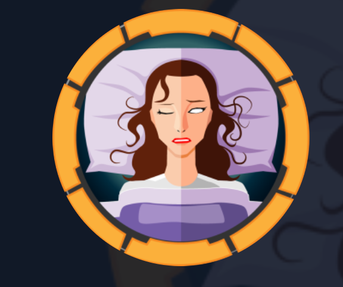
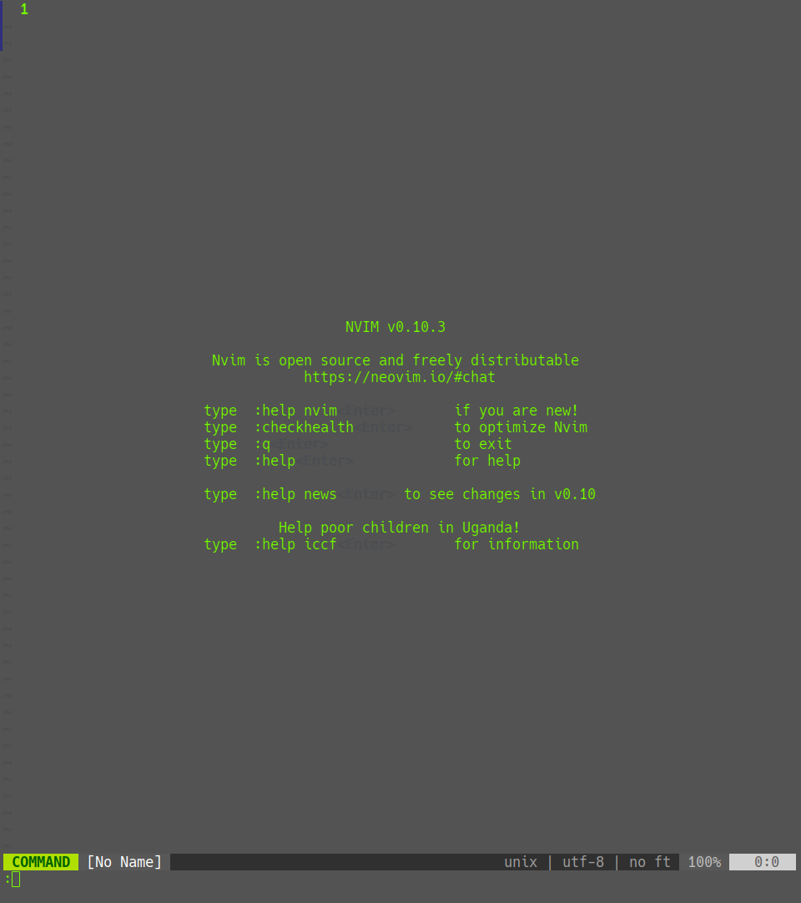

# Cap

<div align='center'>
  
</div>

## Reconociemiento

escaneo de puertos

```bash
 nmap -sS -p- --min-rate 5000 -n -Pn -vvv 10.10.11.221 -oN allPorts
```

<div align='center'>
  
</div>

## enumeracion de servicios

escaneo de servicios

```bash
 nmap -sCV -p53,88,135,139,389,445,464,593,636,3268,3269,5985,60129 -Pn -oN targeted 10.10.11.35
```

<div align='center'>
  
</div>


```bash
Flag: gsgdhsdghsfhsdf***************
```

## Siguenos

<div align='center'>
  <p>Thanks for reading! Follow me on my socials:</p>
  <a href='https://x.com/@imahian'></a>
  <a href='https://discord.gg/dbesG8EX'></a>
  <a href='https://youtube.com/@imahian'></a>
  <a href='https://twitch.tv/imahian'></a>
</div>

---
