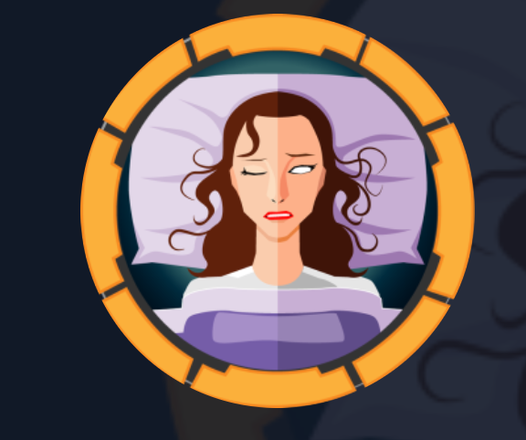
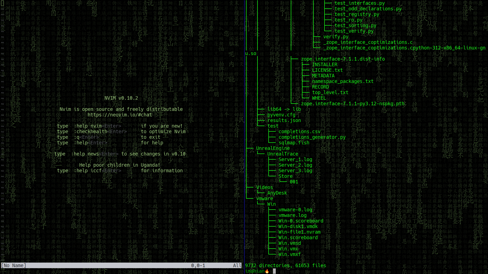
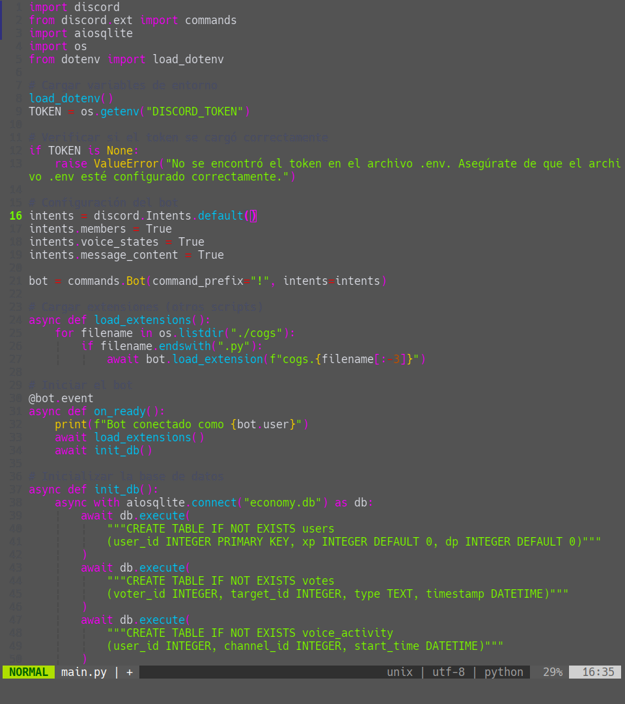

# Cap

<div align='center'>
  
</div>

## Reco

escaneo de puertos [nmap](https://nmap.org)

```bash
 sudo nmap -sS --open --min-rate 5000 -n -Pn -vvv -oG allPorts 10.10.152.174
```

<div align='center'>
  
</div>

## Servicios en puertos

escaneo de servicios

```bash
 nmap -sV -p21,53,88,135,139,389,445,464,593,636,3268,3269,5985 -oN targeted 10.10.11.42
```

<div align='center'>
  
</div>


```bash
Flag: fefwefw*******
```

## Siguenos

<div align='center'>
  <p>Thanks for reading! Follow me on my socials:</p>
  <a href='https://x.com/@imahian'></a>
  <a href='https://discord.gg/dbesG8EX'></a>
  <a href='https://youtube.com/@imahian'></a>
  <a href='https://twitch.tv/imahian'></a>
</div>

---
