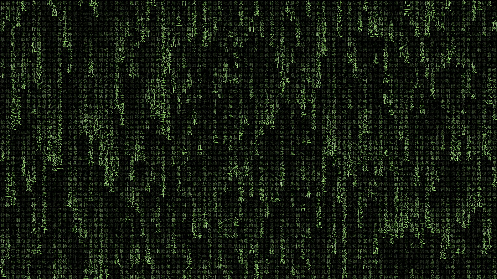
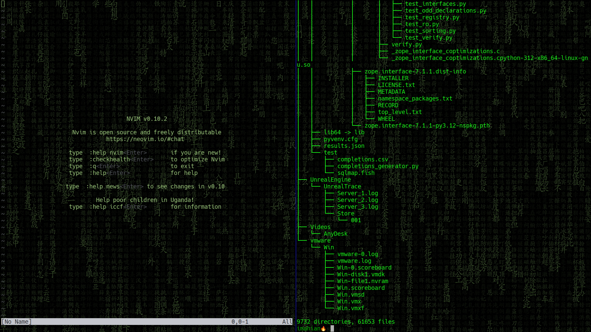
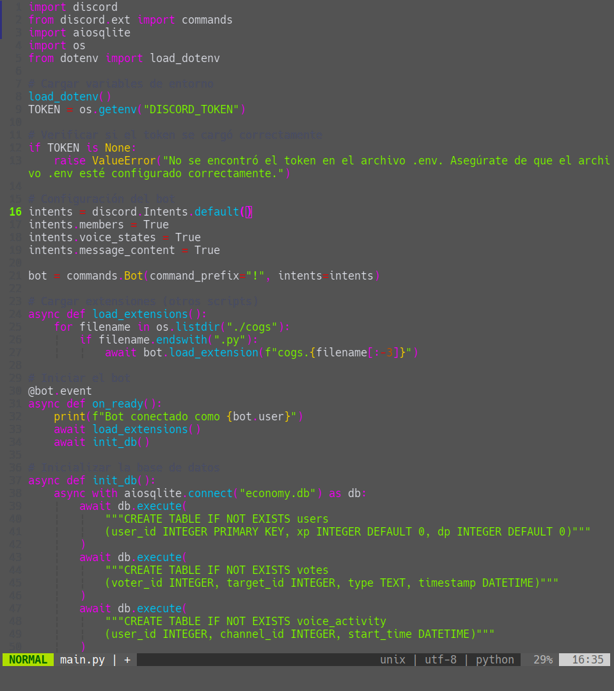

# Cap

# Cap

<div align='center'>
  
</div>

## Reco

Escaneo de puertos con [nmap](https://nmap.org)

```bash
 nmap -sT -T5 --min-rate=10000 -vvv -p- 10.129.216.238
```

<div align='center'>
  
</div>

## Servicios

escaneo de servicios

```bash
 nmap -p 22,631 -sCV 10.10.11.40 -vvv -oN targeted
```

<div align='center'>
  
</div>


```bash
Flag: fefwefw*******
```

## Siguenos

<div align='center'>
  <p>Thanks for reading! Follow me on my socials:</p>
  <a href='https://x.com/@imahian'></a>
  <a href='https://discord.gg/dbesG8EX'></a>
  <a href='https://youtube.com/@imahian'></a>
  <a href='https://twitch.tv/imahian'></a>
</div>

---
