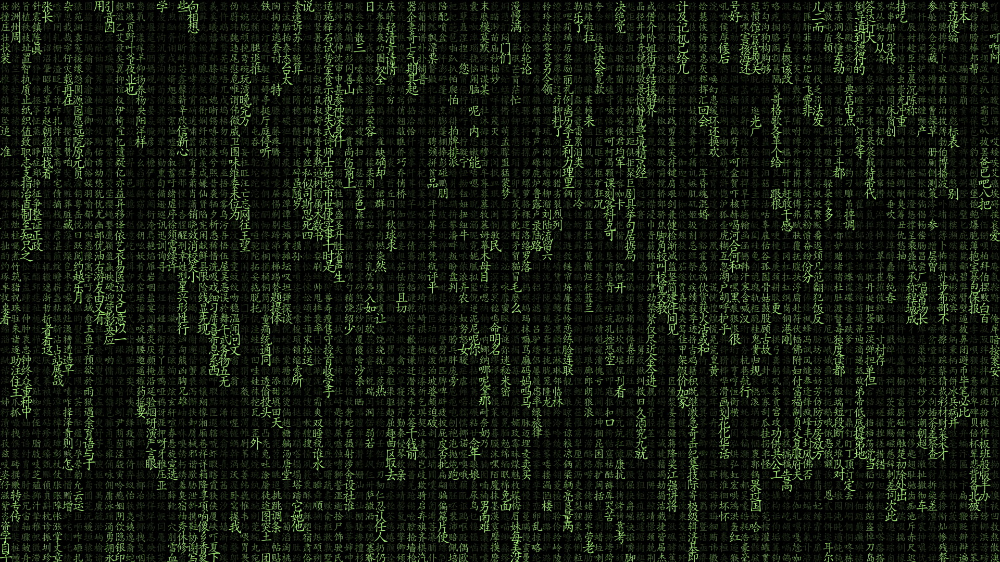

# Prueba

<div align='center'>
  
</div>

## Escaneo de puertos

Vamos A escanear con [nmap](https://nmap.org) y luego subir a [github](https://github.com)

```bash
 nmap -p- -sS --min-rate 5000
```

<div align='center'>
  
</div>


## Siguenos

<div align='center'>
  <p>Thanks for reading! Follow me on my socials:</p>
  <a href='https://x.com/@imahian'></a>
  <a href='https://discord.gg/dbesG8EX'></a>
  <a href='https://youtube.com/@imahian'></a>
  <a href='https://twitch.tv/imahian'></a>
</div>

---
