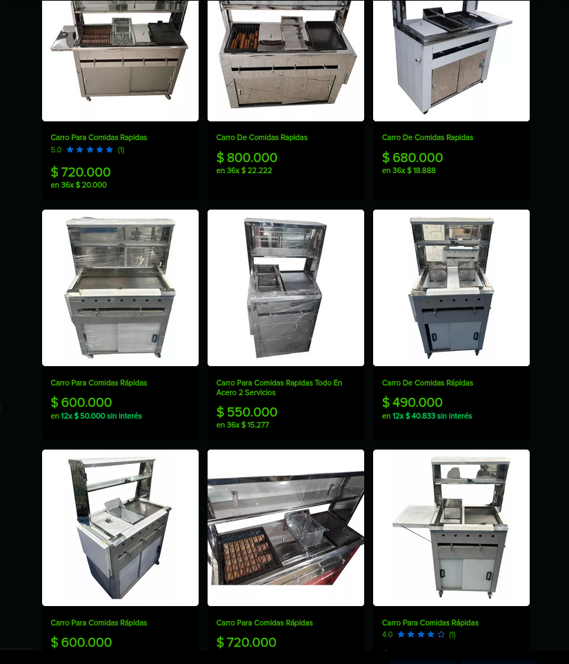
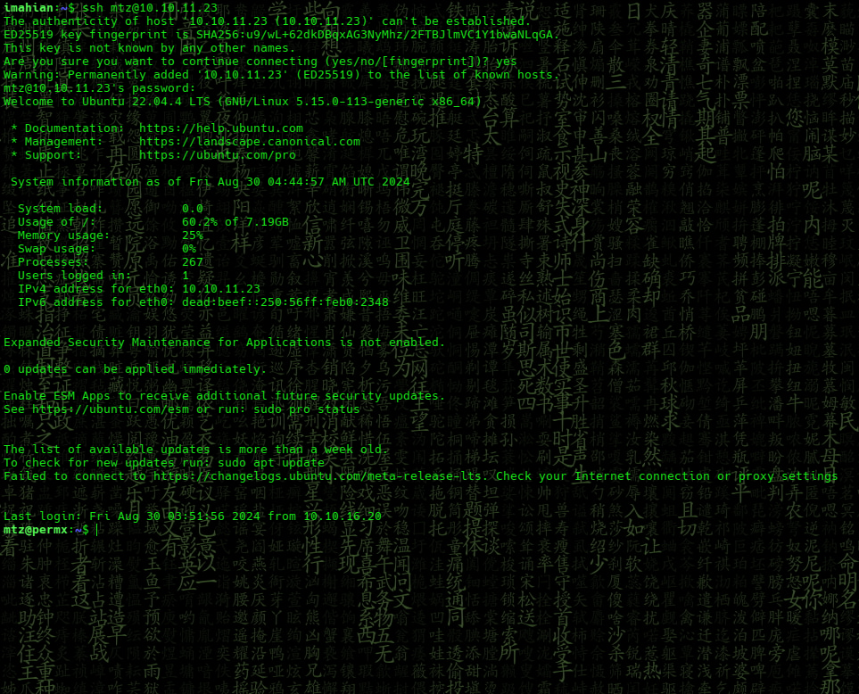
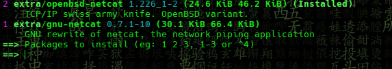

# Bandit0

<div align='center'>
  
</div>

## Recon

Scaning open ports with en [nmap](https://nmap.org)

```bash
 sudo nmap -p- -sS --min-rate 5000 -Pn -vvv -oG allPorts 10.10.11.3
```

<div align='center'>
  
</div>

## services

Services running on ports

```bash
 nmap -sCV -p443,53,445,139,80,5985,3269,49456,49473,49436,9389,3268,49664,49449,464,389,49669,636,88,593 -oN targeted 10.10.11.3
```

<div align='center'>
  
</div>


```bash
Flag: gdfjhdsgjfgd*************
```

## Siguenos

<div align='center'>
  <p>Thanks for reading! Follow me on my socials:</p>
  <a href='https://x.com/@imahian'></a>
  <a href='https://discord.gg/dbesG8EX'></a>
  <a href='https://youtube.com/@imahian'></a>
  <a href='https://twitch.tv/imahian'></a>
</div>

---
