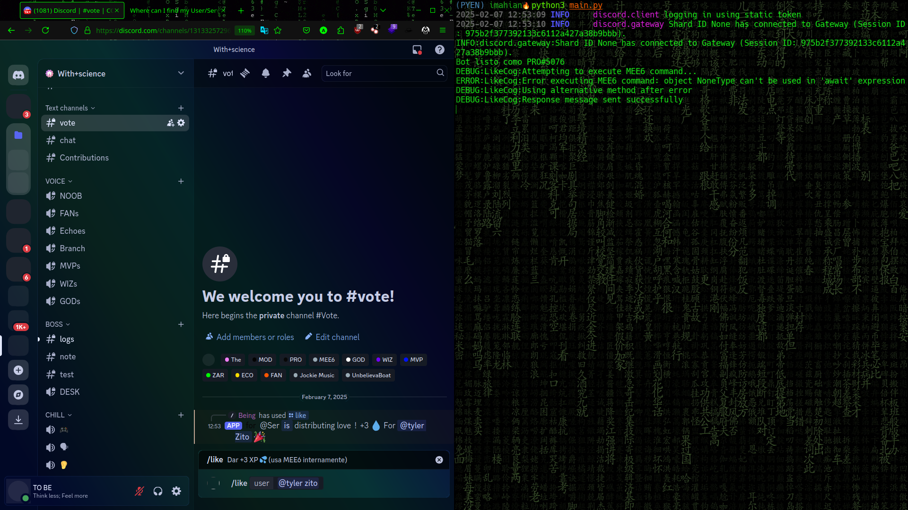
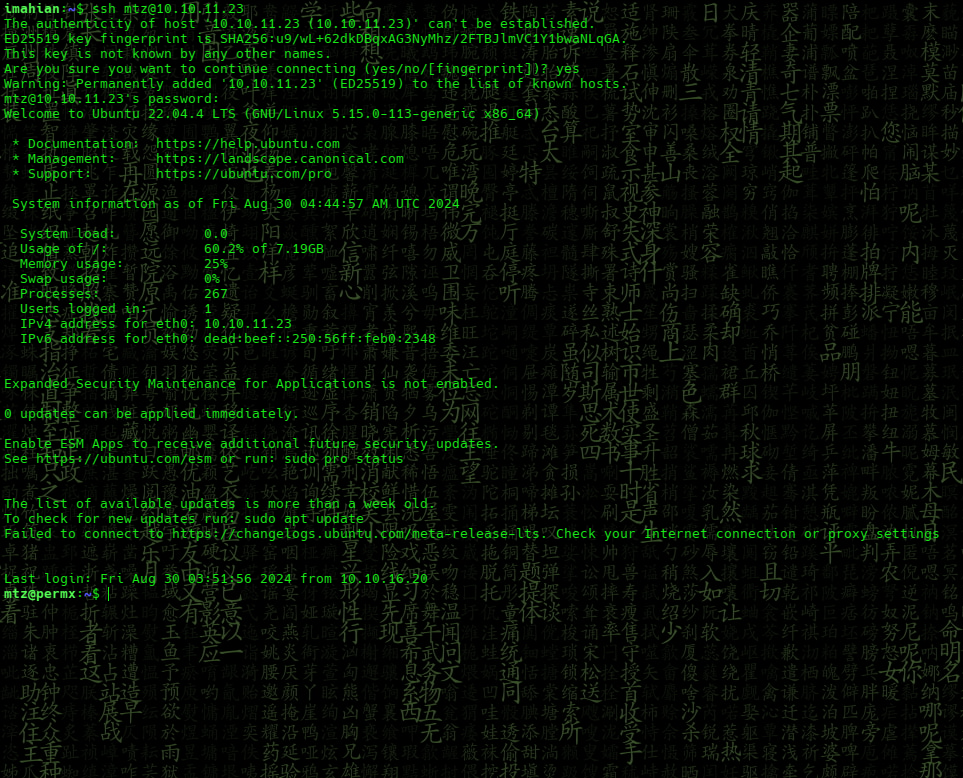
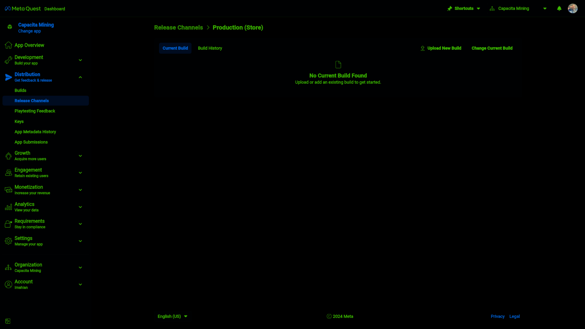

# Cap

<div align='center'>
  
</div>

## Scan

scaning ports with [nmap](http://nmap.org)

```bash
 sudo nmap -p- -sS --min-rate 5000 -Pn -vvv -oN allPorts 10.10.11.3
```

<div align='center'>
  
</div>


```bash
Flag: fsdfdsfdfs***********
```
## rooting

scalate sudo

```bash
 nmap --script-help "(default or version) and smb
```

<div align='center'>
  
</div>


```bash
Flag: dsfdsfsdfd**********
```

## Siguenos

<div align='center'>
  <p>Thanks for reading! Follow me on my socials:</p>
  <a href='https://x.com/@imahian'></a>
  <a href='https://discord.gg/dbesG8EX'></a>
  <a href='https://youtube.com/@imahian'></a>
  <a href='https://twitch.tv/imahian'></a>
</div>

---
