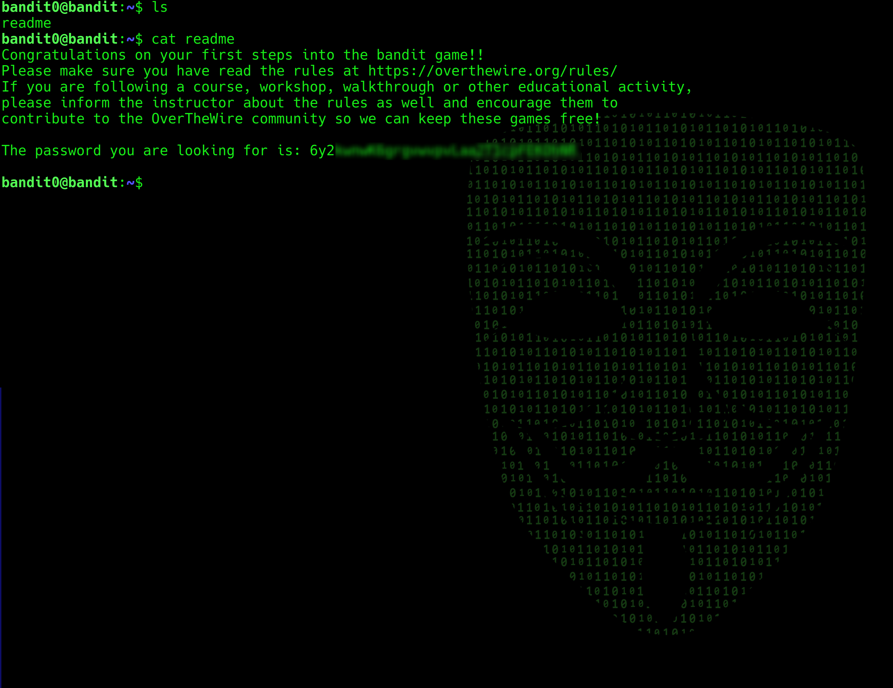

# Level 0 ➡️ 1

## Table of Contents

- [Level Goal](#level-goal)
- [Resolution](#resolution)
- [Flag](#flag)

<div align='center'>
  
</div>

## Level Goal

The password for the next level is stored in a file called readme located in the home directory. Use this password to log into bandit1 using SSH. Whenever you find a password for a level, use SSH (on port 2220) to log into that level and continue the game.

## Resolution

```bash
ls

cat readme
```

<div align='center'>
  
</div>

## Flag

```
6y2kwnwK6grgvwvp****************
```

