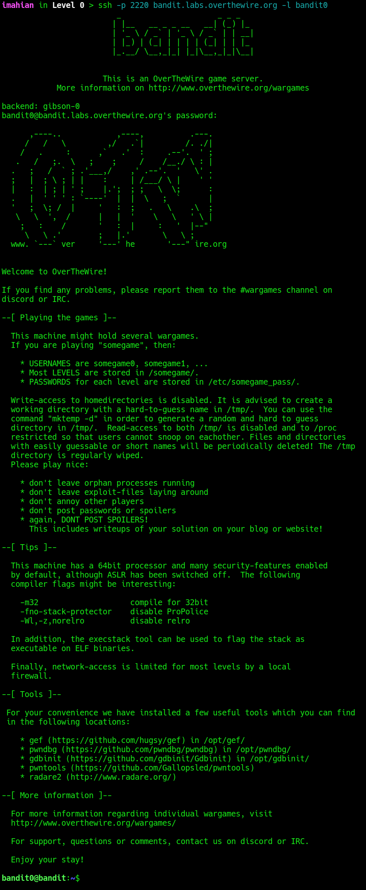

# Level 0

<div align='center'>
  
</div>

## Level Goal

The goal of this level is for you to log into the game using SSH. The host to which you need to connect is bandit.labs.overthewire.org, on port 2220. The username is bandit0 and the password is bandit0. Once logged in, go to the Level 1 page to find out how to beat Level 1.

## Resolution

```bash
ssh -p 2220 bandit.labs.overthewire.org -l bandit0
```

To connect to the first level, use the command ssh -p 2220 bandit.labs.overthewire.org -l bandit0, which breaks down as follows: ssh initiates the Secure Shell client to establish an encrypted remote connection, -p 2220 specifies the custom network port required by the game server (overriding the default port 22), bandit.labs.overthewire.org is the target domain host, and -l bandit0 declares the username for authentication (with the password for this initial level being bandit0). 

<div align='center'>
  
</div>

